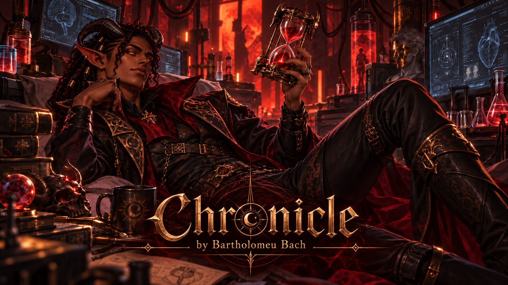

<p align="center">
  
</p>

# Chronicle ⏳

### *Narrative time management for AI Dungeon*

Chronicle is a narrative time-management module designed to help AI Dungeon keep track of **when things are happening**.

It maintains an authoritative in-story calendar and clock, interprets how much fictional time passes during scenes, and continuously keeps the AI aware of the current point in the timeline.

Chronicle is also the first module of a larger project:

# Narrative System Engine

The long-term goal is to build a modular system around AI Dungeon that gives interactive stories stronger internal structure without replacing the AI as the storyteller.

LLMs are great at writing scenes.

They are much less reliable at maintaining systems over long stories.

Time gets confused. Goals disappear. Consequences are forgotten. Characters suddenly know things they should not know. A two-day deadline somehow becomes tomorrow, then next week, then apparently never happened.

The Narrative System Engine is an attempt to give those systems an actual state.

Chronicle begins with time.

Future modules may handle things such as:

* narrative agency and action outcomes;
* quests and objectives;
* character relationships;
* persistent world states;
* inventory and resources;
* long-term consequences;
* narrative pacing and direction.

Each module should remain independent, lightweight, and capable of exposing only the minimum information the storytelling AI actually needs.

The AI should still write the story.

The system should help it remember what is true.

---

## Why am I building this?

Because AI is *really* bad at knowing what day it is.

Imagine this extremely serious narrative situation:

> Your character asks his waifu out on Monday.

She says:

> “Sure. Let's meet here in two days.”

Great.

Wednesday. Easy.

Except twenty turns later you ask:

> “How long until our date?”

And suddenly the AI decides it's Tuesday.

Or Thursday.

Or that the date is tomorrow.

Or that you already went on the date.

Or your waifu appears at your house saying:

> “You're late!”

Meanwhile you are sitting there thinking:

**bro it has been like four fictional hours**

The problem is that the model does not really maintain a clock.

It sees pieces of narrative context and tries to reconstruct the timeline every time it generates something.

For short stories, that can work surprisingly well.

For long adventures...

...good luck.

Chronicle exists to stop asking the narrator to repeatedly guess what time it is.

---

## What Chronicle does

Chronicle maintains a persistent **story time state**.

For example:

```text
Monday, April 13, 2026 — 19:32
```

As the story progresses, Chronicle evaluates what happened and estimates how much fictional time actually passed.

Importantly, it is **not** just a table of predefined action durations.

Chronicle reasons about narrative context.

For example:

```text
"I sit down to eat with my sister."
```

does **not** necessarily mean:

```text
+45 minutes
```

The dinner scene may only be starting.

A few moments may have passed.

Meanwhile:

```text
"We spend the evening eating, drinking and talking."
```

clearly represents a much larger passage of time.

And:

```text
"I trained for days."
```

may advance the story by several days even if that exact action was never predefined anywhere.

The goal is to estimate:

> **How much time actually passed in the story?**

Not:

> **How long does this activity usually take?**

---

## Core principles

### Narrative reasoning over rigid rules

Chronicle can use common activity durations as reference points, but they are only priors.

Narrative evidence always matters more.

A normal meal may take 30–90 minutes.

A rushed meal might take ten.

A disastrous family dinner might last three hours.

Context wins.

---

### Scene progression is not the same as a time skip

Chronicle distinguishes between actively playing through a scene and summarizing an activity.

```text
"I get into bed."
```

does not mean eight hours passed.

```text
"I sleep until morning."
```

probably does.

This distinction helps Chronicle avoid turning ordinary scene transitions into RPG-style automatic time skips.

---

### Incremental time only

Chronicle estimates the amount of time that passed **since the previous update**.

This prevents double counting.

If a dinner scene has already accumulated thirty minutes across several turns, Chronicle should not suddenly add another forty-five minutes just because the characters finally leave the table.

---

### The current state stays small

Chronicle should not dump its entire history into the AI's context.

The storytelling model only needs the current temporal state.

Something like:

```text
[Chronicle]
Monday, April 13, 2026 — 19:32
```

That state is continuously replaced as the story progresses.

---

## Transparent history

Although the storytelling AI only needs the current time, Chronicle also keeps a temporal ledger for the player.

A Chronicle update might internally record something like:

```json
{
  "before": "2026-04-13T19:20",
  "action": "Dinner conversation continued",
  "interpretation": "scene_progression",
  "delta": "12m",
  "reason": "Conversation continued while the meal was already underway.",
  "after": "2026-04-13T19:32"
}
```

The purpose of this history is not to influence the narrator.

It exists so the player can understand:

* why time advanced;
* how Chronicle interpreted an action;
* where timeline mistakes may have happened;
* how the current story time was reached.

In other words:

> **The AI sees the state.
> The user can inspect the reasoning.**

---

## Current scope

The first version of Chronicle focuses only on:

* current story date;
* current story time;
* narrative time deltas;
* scene progression;
* summarized time passage;
* contextual time inference;
* deterministic calendar updates;
* persistent temporal state;
* compact AI context;
* temporal decision logs.

Chronicle does **not** currently attempt to manage:

* future scheduled events;
* quest deadlines;
* NPC schedules;
* hidden or uncertain time;
* character-perceived vs objective time;
* weather;
* seasons;
* event triggering.

Those systems may come later.

For now, the goal is deliberately simple:

> Give the story a clock — and make that clock actually make sense.

---

## Project status

🚧 **Early development**

Chronicle is currently being designed and implemented as the first component of the Narrative System Engine.

Expect experiments, questionable temporal decisions, broken timelines and probably at least one waifu accidentally waiting three days at a restaurant.

That's why we're building it.

---

## License

MIT

Chronicle is intended to be open-source and available for experimentation, modification and integration with other AI Dungeon projects.
